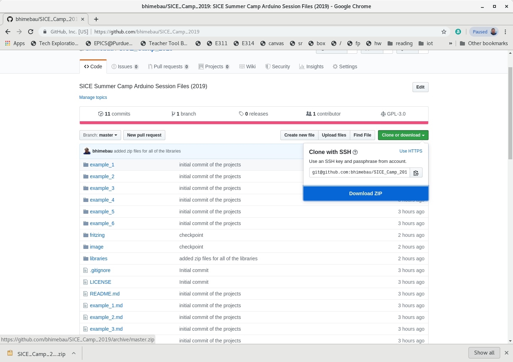
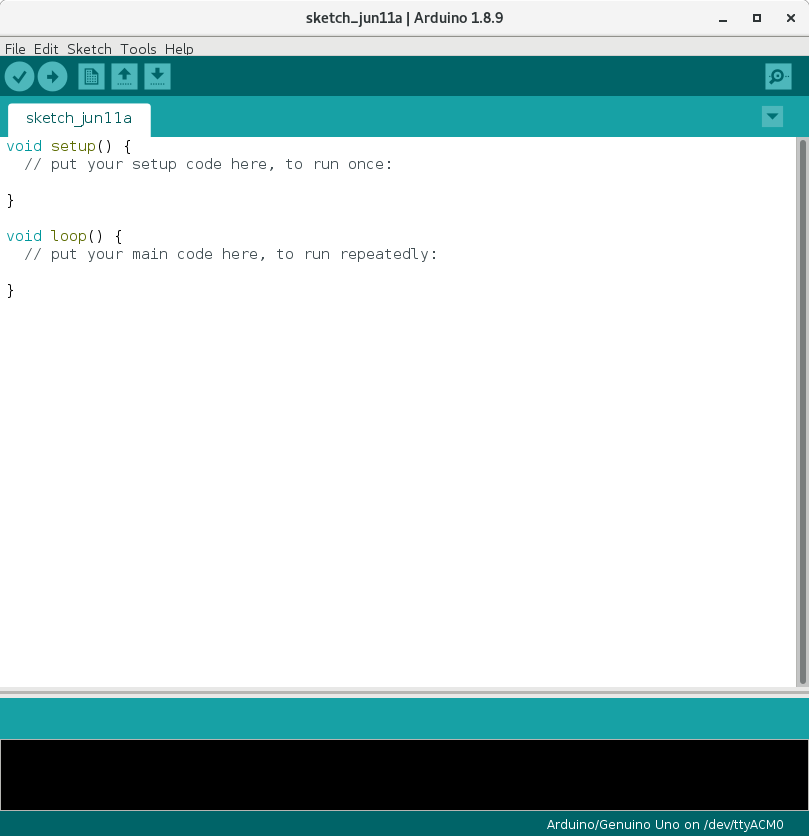

## Downloading the SICE Camp Arduino Repository

You should download the code for the camp arduino sessions from the following location. You should use the **Clone or download" button on the right side of the page to select the **Download ZIP** option. 

```bash
https://github.com/bhimebau/SICE_Camp_2019
```



## Starting the Arduino Software

Use the following command from the SICE lab machines to start the Arduino software.

```bash
[bhimebau@batman:~] $ /l/arduino/arduino
```


## Installing Libraries

The libraries that are required for the camp arduino sessions are
included in the **libraries** folder of the SICE Camp Arduino
Repository that was downloaded above.

Select this option from the Sketch menu: **Sketch->Include Library->Add ZIP Library ...**. One at a time, you should add the 3 libraries in the **libraries** folder. 

**You must restart the arduino IDE software before the libraries will be available.** After you restart the software, you will notice that the following examples are available in **File->Examples->** near the bottom of the list. 

* NewPing 
* TFT Touch Shield v2.0 
* Touch Screen Driver


