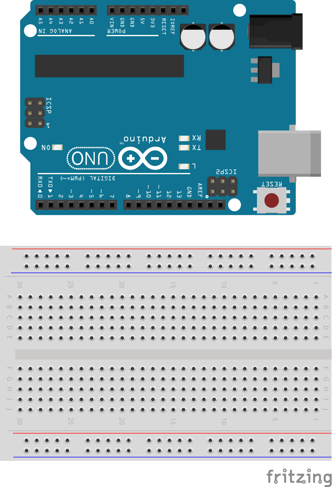
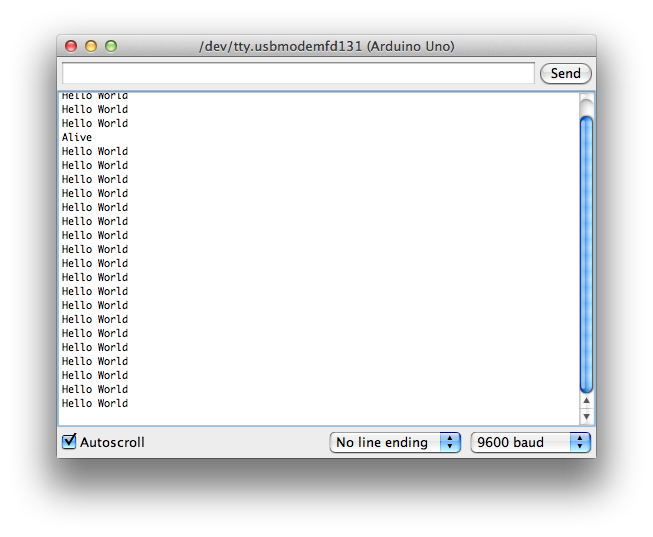

# Example 1

## Overview

Warm-up example to get started with the Arduino. This example prints "World World" on the serial console. 

## Hardware Setup



## Software

```c++
void setup() {
  // put your setup code here, to run once:
  Serial.begin(9600);
  Serial.print("Alive\n");
}

void loop() {
  // put your main code here, to run repeatedly:
  Serial.println("Hello World");
  delay(1000);
}
```
[Repository Source](example_1/example_1.ino)

## Output 




## Exploration

* What happens when you change the value of the argument to the delay function? 


