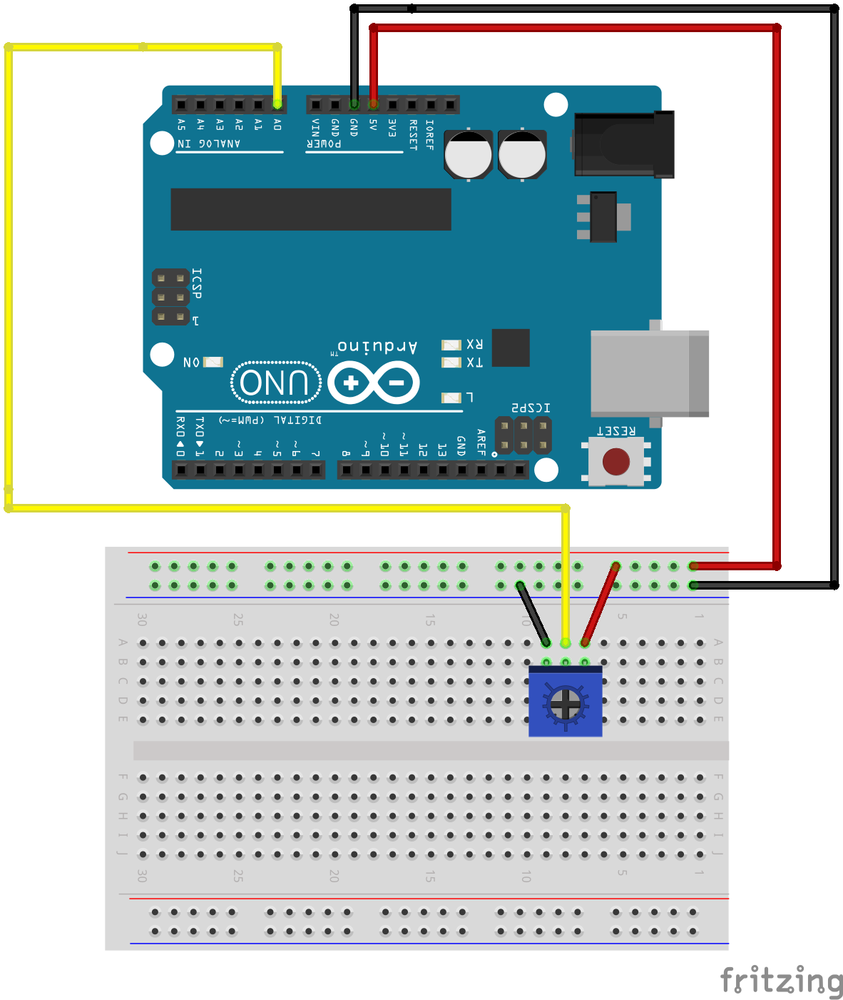

# Example 2

## Overview

Read the voltage from a potentiometer and report the value.

## Hardware Setup



## Software

```c++
int sensorPin = A0;

void setup() {
  // put your setup code here, to run once:
  Serial.begin(9600); 
  Serial.print("Alive\n");
  
}

void loop() {
  int sensorValue;
  
  // put your main code here, to run repeatedly:
  sensorValue = analogRead(sensorPin);
  Serial.println(sensorValue);
  delay(1000);
}
```
[Repository Source](example_2/example_2.ino)

## Output 


## Exploration

* Print a message when the value of the sensor input is greater than a threshold.
* The sensorValue variable reports the number of A2D counts. Convert and print the actual voltage. 

