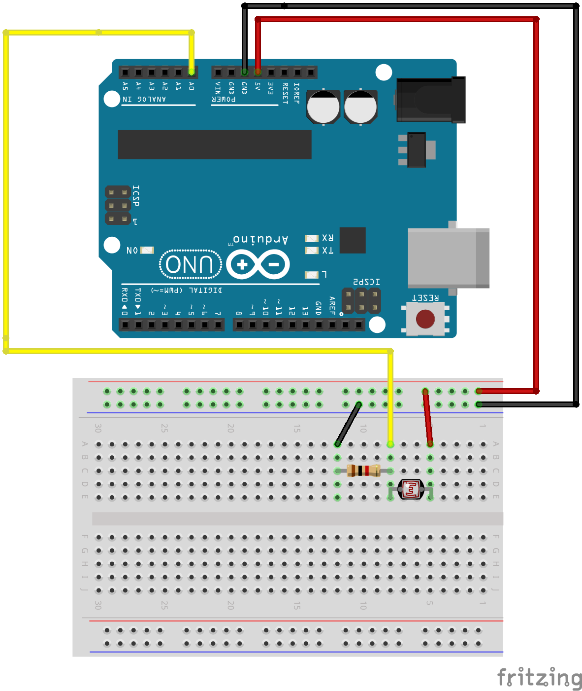
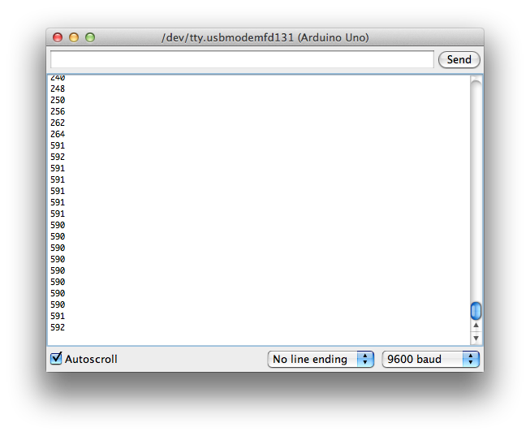

# Example 3

## Overview

Read the voltage from a light sensor and report the value. 

## Hardware Setup



## Software

```c++
int sensorPin = A0;

void setup() {
  // put your setup code here, to run once:
  Serial.begin(9600); 
  Serial.print("Alive\n");
  
}

void loop() {
  int sensorValue;
  
  // put your main code here, to run repeatedly:
  sensorValue = analogRead(sensorPin);
  Serial.println(sensorValue);
  delay(1000);
}
```
[Repository Source](example_3/example_3.ino)

## Output 




## Exploration 

* The variable sensorValue gets larger when the sensor gets more light. Change the circuit to cause sensorValue to become smaller as the sensor an increasing amount of light. 
