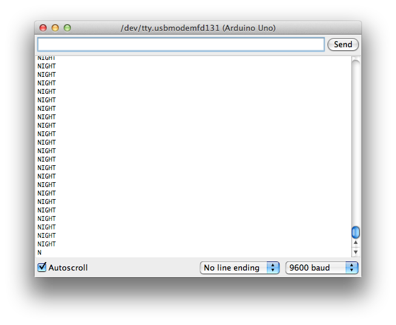

# Example 5

## Overview

Create a nightlight by linking the led output to the value of the light sensor. 

## Hardware Setup


## Software

```c++
#define THRESHOLD 475

int ledPin = 2;
int sensorPin = A0;

void setup() {
  // put your setup code here, to run once:
  Serial.begin(9600); 
  Serial.print("Alive\n");
  pinMode(ledPin, OUTPUT);
}

void loop() {
  // put your main code here, to run repeatedly:
  int sensorValue;

  sensorValue = analogRead(sensorPin);
  if (sensorValue < THRESHOLD) {
    digitalWrite(ledPin, HIGH);  // Turn on the light
    Serial.print("NIGHT\n");
  }
  else {
    digitalWrite(ledPin, LOW);
    Serial.print("DAY\n");
  }
}
```
[Repository Source](example_5/example_5.ino)

## Output 




## Exploration 

* The example program prints "NIGHT" or "DAY" repeatedly. How would you change the program to only print the "NIGHT" or "DAY" one time for each transition? 
