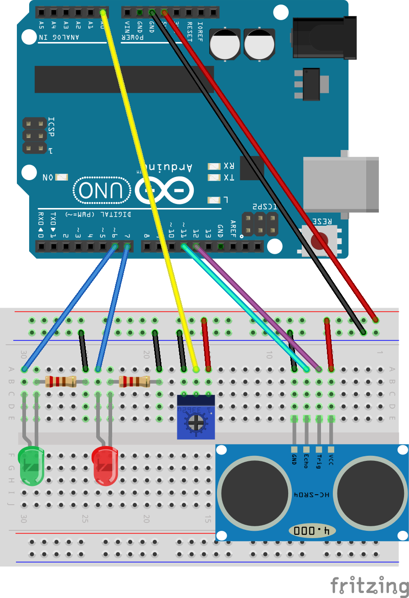

# Example 6

## Overview

Create a parking assistance device called parking buddy. This device
will aid a driver in getting their car a specific distance from a garage wall. 

## Library Setup
Copy **libraries/Newping** to **Documents/Arduino/libraries**. You will need to restart the Arduino IDE before the Newping library can be used."

## Hardware Setup

## Software

### Starting with an example
Load the sonar example from the file menu in the Arduino Software: **File->NewPing->NewpingExample**. You will use this as a starting point for your software. Save the example to the example_6 subdirectory.

### Using what you have learned from example_1-5.
Use your experiences from example_1 through example_5 to get the LEDs and the potentiometer working.

### Writing the parking buddy application
The parking buddy application is used to tell a driver when they have their car the proper distance from the front wall in a garage. The device should have the following behaviors:

* The red led should be used to tell the driver when to stop.
* The green led should flash to indicate that the driver is getting close to the stopping point.
* The green led should be on when there is nothing in range of the sensor. 
* The potentiomter should be used to set the distance where the red led turns on. This allows the device to be easily calibrated. 

## Output 
You should design your output to allow the device to be tested. 

## Exploration 

* Experiment with other ways of using the LEDS to notify the driver.
* Think of other applications that you might be able to building using these components. 
